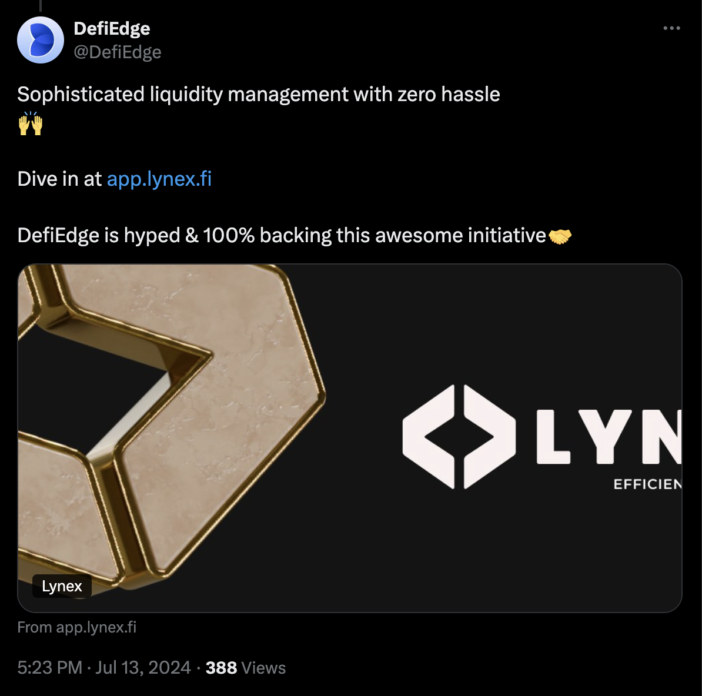

# DefiEdge Announcements and Integrations

## Defiedge Demo
[View Demo](https://www.youtube.com/watch?v=wR3wDv9h9EI)

# DeFiEdge Timeline

## 2024

### November 2024
- Liquidity Providers Milestone: More than 1k LPs.
- Network Integration Milestone: Live on 15+ Networks.

### July 2024
- **EthCC Participation:** Showcased leadership at a global event and strengthened partnerships.

### June 2024
- **Voting Manager on Lynex:** Led strategic decision-making within the Linea and Lynex ecosystems.

### May 2024
- **Volume Milestone:** Highest Volume reached $7B.
- **DEXes Integration:** Integrated over 15 DEXes.
- **XLayer Partnership:** Expanded our DeFi impact through new chain integrations.
- **Linea Chain Integration:** Advanced our multi-chain strategy.
- **Graph Protocol Partnership:** Upgraded to Graph Protocol for powering subgraphs on Linea, Polygon zkEVM, and X Layer chains.

### April 2024
- **CakePie Partnership:** Collaborated for efficient voting and bribes on PCS Arbitrum and BNB Chain, distributing $23,000 worth of ARB rewards to users.

### March 2024
- **Stake Dao Partnership:** Expanded DeFi capabilities and managed $SDT token liquidity.
- **Arbitrum STIP Rewards:** Secured an additional 500,000 ARB grants for Camelot, PancakeSwap, and PCS Arbitrum liquidity, distributed among users.
- **Arbitrum STIP Collaboration:** Received and distributed a 200,000 ARB grant among our users.

### February 2024
- **Fren Reviews Feature:** Recognized for innovations in DeFi.
- **Linea and Lynex Partnerships:** Strengthened the ecosystem through strategic collaborations.
- **Algebra Partnership on Thena:** Managed the $ALGB/$BNB pool, optimizing liquidity.

### January 2024
- **Debank Cloud Launch:** Partnered with Debank Cloud to connect with a real user-based Web3 community.
- **Quickswap V3 Integration:** Enhanced asset management with Merkl and Horiza integrations, strengthening our DeFi offerings.

## 2023

### December 2023
- **Position Manager on PancakeSwap:** Led liquidity strategies across BNB, Arbitrum, zkSync, Polygon zkEVM, and Base.
- **Algebra Collaboration:** Innovated DEX operations with new engine and mechanisms.
- **Thena Partnership on BNB Chain:** Solidified our position and expanded offerings within the BNB ecosystem.

### November 2023
- **Launch of ALO:** Optimized liquidity management with Automated Liquidity Optimization.
- **Fjord Foundry & Quantstamp Partnerships:** Advanced DeFi innovation and security.
- **Quickswap Integration on Polygon:** Expanded our multi-chain strategy.

### October 2023
- **Nexus Mutual & Opencover Partnerships:** Enhanced user security with strategic insurance solutions.
- **OpenPad AI Collaboration:** Integrated AI-driven insights to elevate DeFi offerings.

### September 2023
- **Camelot DEX on Arbitrum:** Expanded DeFi presence through strategic integration on Arbitrum.
- **PancakeSwap Expansion:** Extended our collaboration to Arbitrum’s ecosystem.

### August 2023
- **PancakeSwap Integration on BNB Chain:** Strengthened liquidity infrastructure, becoming the leading position manager on PancakeSwap.

### May 2023
- **TVL Milestone:** Highest TVL reached $16M.

### March 2023
- **SBT Campaign with xHashtag:** Exclusive campaign with xHashtag.
- **BNB Expansion Announcement:** DefiEdge announces expansion to BNB Chain.

### February 2023
- **DeBank Integration:** DefiEdge integrates with DeBank.
- **MVX-USDC Liquidity Management:** Managed liquidity for MVX-USDC on Uniswap (Polygon).
- **Dune Dashboard on Optimism:** Launch of DefiEdge’s dashboard on Optimism.

### January 2023
- **$OP Token Rewards:** 2500 OP tokens distributed on Uniswap V3.
- **Zapper Integration:** DefiEdge successfully integrates with Zapper.

## 2022

### December 2022
- **Defi Llama Integration:** Completed integration with Defi Llama.
- **Unbound Finance Integration:** Collaboration with Unbound Finance.

### November 2022
- **Galxe Partnership Campaign:** Strategic campaign launched with Galxe.
- **Morpho Partnership:** Announced partnership and integration with Morpho.

### October 2022
- **Partnership with Genki:** Web3 marketing platform collaboration.
- **Completion of 6th Audit:** Completed audit by Riley Holterhus.

### September 2022
- **Multifarm.fi Integration:** DefiEdge integrates with Multifarm.fi.
- **Solv Protocol Integration:** Strategic integration with Solv Protocol.

### August 2022
- **Newsletter Launch:** Introduction of DefiEdge's newsletter.
- **Completion of Watchpug Audit:** Top researcher at Code4rena.
- **AMA Panel:** Engaged with Keyrock, Stake Capital, Perpetual, and Mangrove.

### July 2022
- **Polygon Discord AMA:** DefiEdge AMA on liquidity management with Uniswap V3.
- **Arbitrum Ecosystem Integration:** Announced integration with the Arbitrum ecosystem.
- **DefiLabs Integration:** Users can now backtest and manage Uniswap V3 strategies.
- **Liquidity Management AMA:** Panel discussion on capital efficiency using Uniswap V3.

### June 2022
- **Chainlink Integration:** DefiEdge integrates with Chainlink for asset management on Uniswap V3.
- **DeFI Talks Episode 1:** Exploring market conditions and strategies for navigating difficult times.
- **DeFi Strategy Show Episode 1:** Smart liquidity management with DefiEdge.
- **DeFI Talks Episode 3:** AMA with Perp V2, covering virtual AMMs and options trading opportunities.
- **DeFI Talks Episode 4:** AMA with Themis Protocol, discussing profits via liquidity management and smart vaults.

### April 2022
- **Audit by ABDK Consulting:** Traditional audit completed.

### January 2022
- **Rinkeby Testnet Launch:** DefiEdge Rinkeby testnet goes live.

## 2021

### December 2021
- **DefiEdge Launch:** Official launch of DefiEdge.
- **Launch of DefiEdge Twitter and Discord Server.**
- **Audit by Damian Rusinek:** Smart contract auditor at Securing.

### September 2021
- **Audit by Lucash-dev:** Recipient of the Whitehat Scholarship from Immunefi, renowned bug bounty hunter at Hackerone.

### July 2021
- **Limit Order Integration and MVP Launch:** Successfully integrated limit orders and launched the MVP version of DefiEdge on Uniswap V3, showcasing core liquidity management capabilities.

### May 2021
- **Testnet Launch on Uniswap V3:** DefiEdge launched its initial testnet, enabling early testing and feedback on Uniswap V3 liquidity management features.

## Important Events

### Testnet Launch on Uniswap V3
[View Tweet](https://x.com/DefiEdge/status/1480627763694374918)  

### Chainlink Integration
[View Tweet](https://x.com/DefiEdge/status/1605338361421758464)  

### Arbitrum STIP Incentives Launch
[View Tweet](https://x.com/DefiEdge/status/1767258819548049676)  

### Integration with Defilab.xyz
[View Tweet](https://x.com/DefiEdge/status/1568166361951772672)  

### Integration with Multifarm.fi
[View Tweet](https://x.com/DefiEdge/status/1568166361951772672)  

### Partnership with Solv Protocol
[View Tweet](https://x.com/DefiEdge/status/1572939102940696577)  

### Partnership with Genki
[View Tweet](https://x.com/DefiEdge/status/1581243562037243904)  

### Integration with Morpho
[View Tweet](https://x.com/DefiEdge/status/1595434319933120512)  

### Partnership with Defillama
[View Tweet](https://x.com/DefiEdge/status/1715340620955574766)  

### Partnership with Unbound Finance
[View Tweet](https://x.com/DefiEdge/status/1715340605654716821)  

### $OP Token Rewards
[View Tweet](https://x.com/DefiEdge/status/1615422491056574464)  

### Zapper Integration
[View Tweet](https://x.com/DefiEdge/status/1619716430496415746)  

### DeBank Integration
[View Tweet](https://x.com/DefiEdge/status/1619716430496415746)  

### MVX-USDC Liquidity Management
[View Tweet](https://x.com/DefiEdge/status/1625163304548331522)  

### SBT Campaign with xHashtag
[View Tweet](https://x.com/DefiEdge/status/1632383267088527361)  

### Dune Dashboard on Optimism
[View Tweet](https://x.com/DefiEdge/status/1625874376217485314)  

### SBT Campaign
[View Tweet](https://x.com/DefiEdge/status/1550872919386968066)  

### TVL Milestone
[View Tweet](https://x.com/DefiEdge/status/1550872919386968066)  

# Partnership Announcements

### PancakeSwap 
[View Tweet](https://x.com/pancakeswap/status/1733108453424648666?s=46)

### Thena
[View Tweet](https://x.com/thenafi_/status/1758459923669594257?s=46)

### Camelot
[View Tweet](https://x.com/camelotdex/status/1689899001112383488?s=46)

### Silo Labs
[View Tweet](https://x.com/silofinance/status/1771805002388119822?s=46)

### Lodestar Finance
[View Tweet](https://x.com/lodestarfi/status/1770007022358110708?s=46)

### Umami 
[View Tweet](https://x.com/umamifinance/status/1767883318706536875?s=46)

### Lexer Markets
[View Tweet](https://x.com/umamifinance/status/1767883318706536875?s=46)

### BaseSwap
[view Tweet](https://x.com/umamifinance/status/1767883318706536875?s=46)

### JonesDAO
[view Tweet](https://x.com/jonesdao_io/status/1737158816880296351?s=46)

### Arbitrum Universe
[View Tweet](https://x.com/arb_universe/status/1752984578699169819?s=46)

### Partnership with Nexus Mutual
[View Tweet](https://x.com/DefiEdge/status/1716467293998489660)  

### Integration with Quickswap
[View Tweet](https://x.com/DefiEdge/status/1745064583625339233)  

### Launch of ALO
[View Tweet](https://x.com/DefiEdge/status/1838478252819489249)  

### Integration with Thena
[View Tweet](https://x.com/DefiEdge/status/1693611388198080755)  

### Integration with Lynex
[View Tweet](https://x.com/DefiEdge/status/1812092916904452104)  

### Arbitrum STIP Rewards on Pancakeswap
[View Tweet](https://x.com/DefiEdge/status/1770071709992861801)  

### Partnership with StakeDAO
[View Tweet](https://x.com/DefiEdge/status/1786495522770972901)  

### EthCC Participation
[View Tweet](https://x.com/DefiEdge/status/1802835783621218322)  

---

